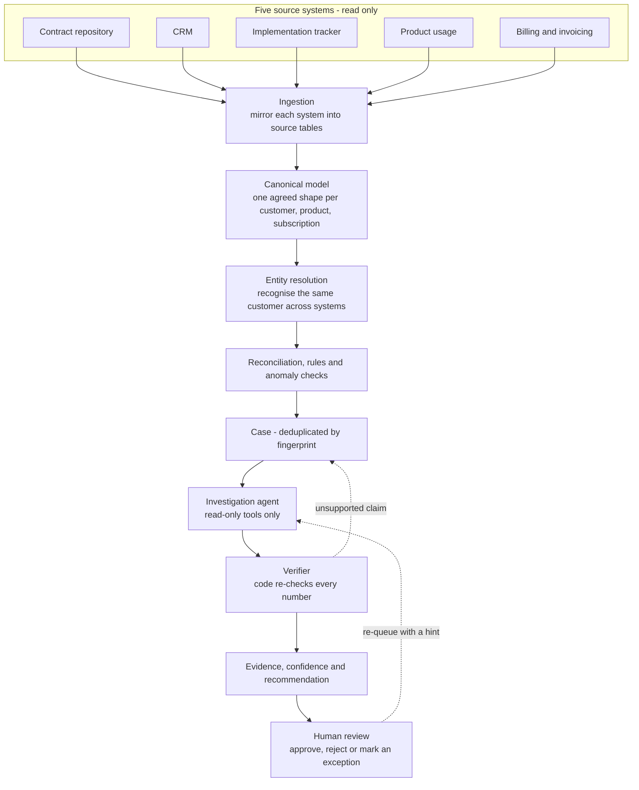
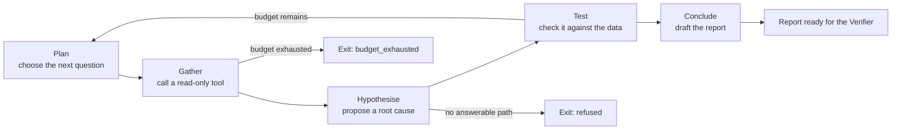

# Architecture

## What this means

A B2B SaaS company records the same deal in five separate systems, and each team
only ever looks at its own. Contract says 100 seats, billing invoices 70, and
nobody notices, because nobody holds all five views at once. This system is the
one place that holds all five.

The architecture is shaped by a single idea: **separate the thing that knows the
rules from the thing that reads the prose.** Money, dates, seat counts and
reconciliation rules are handled by ordinary deterministic code (deterministic
means: the same input always produces the same output). Language — contract
clauses, explanations, narratives — is handled by a large language model. The
two never swap roles, and a third component, the Verifier, re-checks the model's
claims against the database before anything reaches a human.

Nothing in this system changes a financial record. It reads five systems,
explains where they disagree, puts a number on the disagreement, and hands a
proposal to a person in Finance. That is the whole product.

## The end-to-end pipeline

Two details matter more than they look. **Deduplication**: a mismatch that
persists for five months is one case, not five, because the case key
(fingerprint) deliberately excludes the billing period. Without that, the review
queue is unusable. **The Verifier**: it sits between the model and the human and
has veto power. It re-fetches every cited row and re-checks every number; a
claim it cannot ground is dropped, or the case is downgraded to `NEEDS_REVIEW`.

## The agent loop

The investigation agent is a hand-rolled loop, not a framework. It runs under two
hard budgets — a maximum number of tool calls and a maximum number of tokens —
and every step is persisted to `agent_trace_step` so the reasoning is replayable.

Exiting without a conclusion is a valid outcome, not a failure. `refused`,
`budget_exhausted` and `error` are all recorded as `terminal_reason` on the
investigation run, and each of them routes the case to a human rather than
producing a confident guess.

## The five classes of data

Every table in the database belongs to exactly one class. The class is not
decoration — it decides who may write the table and whether a value can be
trusted as a fact.

| Class | What it holds | Written by | Trust level |
|---|---|---|---|
| Source-derived | A mirror of what an external system reported, plus the raw payload | Ingestion only, append-only | Reported truth, never corrected |
| Normalized | The resolved, agreed view: one customer, one product, one price rule | Ingestion and entity resolution | Canonical truth |
| Derived | Computed from other tables: billing periods, reconciliation results, case amounts, confidence scores | Deterministic code | Reproducible truth |
| AI-generated | Model prose: hypotheses, narratives, trace steps, Q&A answers | The agent | A claim, never a fact |
| Human-decision | Approvals, rejections, approved exceptions, recorded outcomes | A named person | Authoritative truth |

This separation is a security and auditability boundary, not a naming convention.
It is enforced by the database rather than by discipline:

- The agent connects as a dedicated Postgres role with `SELECT` only on the
  source tables. The requirement "never mutate an invoice" is therefore a
  permission the database grants or withholds, not a promise in a code review.
- The application role used by ingestion may `INSERT` source rows but has no
  `UPDATE` or `DELETE` on `invoice`, `invoice_line`, `contract` and
  `subscription_line`.
- `audit_event` and `agent_trace_step` carry database triggers that raise an
  exception on `UPDATE` or `DELETE`, so the history cannot be rewritten.
- The AI class never feeds a number into a financial total. Where the model
  contributes at all, it contributes prose plus exactly one enum value,
  `contract_clarity` (how clearly the contract states its terms).

Keeping the classes apart is what makes the audit trail honest. If model output
and computed money lived in the same column, a reader could not tell which
figure had been checked and which had been guessed.

## Where AI is used, and where it is not

| Handled by AI | Handled by deterministic code |
|---|---|
| Reading contract prose and extracting terms | Every currency amount, seat count and quantity |
| Explaining what a discrepancy means in plain English | Date arithmetic, billing periods, proration |
| Synthesising several findings into one narrative | Invoice totals and line-level sums |
| Drafting a proposed correction for a human to edit | Reconciliation and tolerance rules |
| Answering "ask the investigator" questions from one case's evidence | Currency conversion and FX walk-back |
| One enum only: `contract_clarity` | Confidence scores, bands and gate checks |
| Retrieving the relevant clause for a question | Annualisation and recovered-revenue totals |

The rule of thumb: **the model reads and explains, code counts, the human
decides.** If a number ever appears in model output and would be stored or
displayed, that is a bug — the fix is a new read-only tool, not a smarter prompt.

## Failure and degradation

The most common way to build this badly is to make the system always produce an
answer. Here, refusing is a first-class outcome.

| Situation | Status | What happens |
|---|---|---|
| Required evidence is missing | `NEEDS_REVIEW` | Confidence is capped at 74, so the case can never reach the high band, and it is assigned to Finance |
| Two sources contradict each other on the decisive fact | `CONFLICTING_EVIDENCE` | Both sides are stored in the verifier report; a human picks the source of truth |
| An approved discount, free pilot or grace period explains the gap | `VALID_EXCEPTION` | No LLM call is spent; the case is closed with the matching exception as the reason |
| The agent cannot reach a conclusion within budget | `NEEDS_REVIEW` | The trace is kept, `terminal_reason` is set, and a human takes over |
| The Verifier cannot ground a numeric claim | `NEEDS_REVIEW` | The claim is dropped and confidence is capped at 60 |
| No FX rate exists on or before the period end | `insufficient_data` | The period is excluded from aggregate totals rather than silently converted at 1.0 |

Note the shape of these outcomes: three of the six end in a human's queue, and
none of them end in an invented number. A case that says "I could not determine
this" is more useful than one that says "leakage: $3,600" with nothing behind it.

## What is deliberately absent

| Not included | Why |
|---|---|
| LangChain, LangGraph, LlamaIndex or similar agent frameworks | The loop is about 200 lines; a framework adds version churn and hides the budget logic we most need to test |
| Celery, Redis, RabbitMQ or Kafka | A Postgres job table with `FOR UPDATE SKIP LOCKED` is sufficient at this scale and removes two services to operate |
| n8n or any visual workflow tool | The pipeline is code with tests; a drag-and-drop layer would be untestable and invisible to review |
| Real authentication | Roles are seeded and switched by header. This is a demo of the reconciliation and investigation logic, not of identity management |
| Multi-tenancy | One company, one database. Tenant isolation would add a column to every table and a filter to every query, for no product benefit here |
| ML anomaly detection models | Thresholds and reconciliation rules are explainable and auditable; a learned model's findings could not be defended to Finance or to an auditor |

Each absence is a deliberate trade: the removed component would have cost more in
operational surface, review difficulty or unexplainability than it returned.

## Where to read next

- [data-model.md](data-model.md) — every table, its class and its write rules.
- [confidence.md](confidence.md) — how the confidence score is computed from eight weighted factors and five gates.
- [case-lifecycle.md](case-lifecycle.md) — the full state machine, including every legal transition.
- [billing-periods.md](billing-periods.md) — the highest-risk area: dates, anchors and proration.
- [evaluation.md](evaluation.md) — how detection quality, money accuracy and citation grounding are measured.
- [adr/](adr/) — one file per locked decision, with the reason it was locked.
