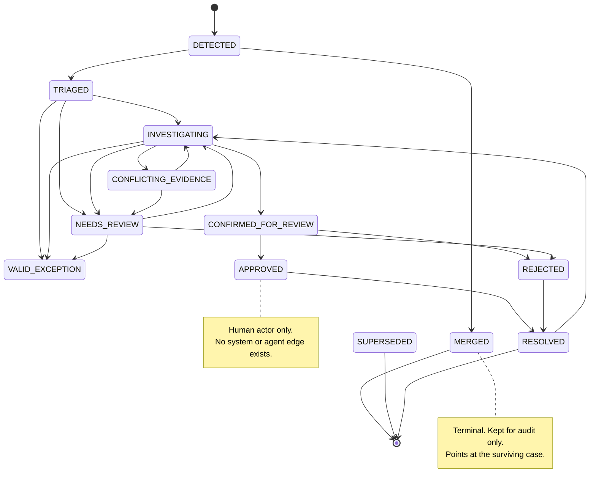

# Case lifecycle

## What this means

A **case** is one disagreement between systems that the product has decided is
worth someone's attention — for example *"the contract says 100 seats, the
invoice says 70"*. Once a case exists it moves through a series of states: found,
triaged, investigated, confirmed, approved, resolved.

Why does the exact set of allowed moves matter? Because a financial system that
can move a case from *"a robot thinks this might be wrong"* straight to
*"resolved, money recovered"* is a system that can silently skip human review.
The state machine exists to make that impossible **structurally** rather than by
convention. There is exactly one function that can change a case's status, it
validates the edge against a fixed table, and it refuses anything not in the
table. No ticket, no bug fix, and no future feature can route around it.

Two rules follow from this and are worth stating up front:

1. **`APPROVED` can only be entered by a human actor.** There is no system or
   agent transition into it.
2. **Every transition writes exactly one `audit_event`.** If a status changed and
   there is no audit row, something bypassed the machine — and that is a bug.

Implementation lives in `backend/app/cases/state.py`.

## The state machine

## Allowed transitions

`actor` is who is permitted to make the move. `guard` is the condition that must
hold before it is allowed.

| From | To | Actor | Guard / trigger | Side effects |
|---|---|---|---|---|
| — | `DETECTED` | system | `reconciliation_result.status = 'mismatch'` and the fingerprint upsert creates a new case | `case_period` rows created; `change_event` linked |
| `DETECTED` | `TRIAGED` | system | triage rules have run: exception lookup, dedup and materiality | `confidence_score` pre-computed; `severity` set |
| `DETECTED` | `MERGED` | system | fingerprint matches an existing open case | `superseded_by_case_id` set |
| `TRIAGED` | `VALID_EXCEPTION` | system | an `approved_exception` overlaps the period scope | `case_outcome = accepted_exception` |
| `TRIAGED` | `INVESTIGATING` | system (worker) | no exception, material, LLM budget available | `investigation_run` created; job enqueued |
| `TRIAGED` | `NEEDS_REVIEW` | system | insufficient data, or below materiality, or no LLM budget | assigned to the seeded Finance role |
| `INVESTIGATING` | `CONFIRMED_FOR_REVIEW` | agent + verifier | Verifier passed all numeric claims **and** confidence ≥ 75 | `recommendation` created with status `proposed` |
| `INVESTIGATING` | `NEEDS_REVIEW` | agent | Verifier failed, or confidence < 75, or budget exhausted | `terminal_reason` recorded |
| `INVESTIGATING` | `CONFLICTING_EVIDENCE` | agent / verifier | two sources contradict each other on the decisive fact | conflict pair stored in `verifier_report` |
| `INVESTIGATING` | `VALID_EXCEPTION` | agent (escape hatch) | agent surfaces an exception triage did not catch | requires human confirmation to finalise |
| `CONFIRMED_FOR_REVIEW` | `APPROVED` | **human** | reviewer approves the recommendation | `recommendation.status = 'approved'`; audit written |
| `CONFIRMED_FOR_REVIEW` | `REJECTED` | **human** | reviewer rejects with a reason code | `case_outcome = false_positive` |
| `NEEDS_REVIEW` | `INVESTIGATING` | human | reviewer re-queues with a hint | new `investigation_run` |
| `NEEDS_REVIEW` | `REJECTED` / `VALID_EXCEPTION` | human | reviewer decides directly | outcome recorded |
| `CONFLICTING_EVIDENCE` | `NEEDS_REVIEW` / `INVESTIGATING` | human | human picks a source, or new evidence is ingested and triggers a re-run | new run |
| `APPROVED` | `RESOLVED` | system | `case_outcome` written (`recovered` or `written_off`) | recovered amount enters the ledger |
| `REJECTED` | `RESOLVED` | system | outcome `false_positive` recorded | — |
| `RESOLVED` | `INVESTIGATING` | human | reopen with new evidence or a new period | new `investigation_run`; prior amounts preserved |

`MERGED` and `SUPERSEDED` are **terminal** for the merged case. They are kept
rather than deleted, because the audit trail has to show that a duplicate was
recognised and folded in rather than lost.

## Reading the diagram

- **`DETECTED → TRIAGED` is where the cheap wins happen.** Triage runs the
  exception lookup before any model is called. A case covered by an approved
  discount is closed as `VALID_EXCEPTION` with **zero LLM calls**. That is both a
  cost saving and a correctness property: the deterministic answer is the one
  that gets used.
- **`INVESTIGATING` has four exits, and three of them are "I am not sure".** The
  only way out that claims an answer is `CONFIRMED_FOR_REVIEW`, and it requires
  both a Verifier pass and confidence ≥ 75. The other three exits are the honest
  ones.
- **`VALID_EXCEPTION` is reachable from two places** — triage (deterministic) and
  investigation (the agent's escape hatch). The agent path requires human
  confirmation to finalise, because "the AI found a reason not to collect money"
  is exactly the kind of claim that needs a person behind it.
- **`RESOLVED → INVESTIGATING`** is the reopen edge. Reopening never edits
  history: it creates a new `investigation_run` and a new report version, and the
  prior amounts stay on the record.
- **Human-only edges** are `CONFIRMED_FOR_REVIEW → APPROVED`, `→ REJECTED`, and
  the two edges out of `NEEDS_REVIEW` and `CONFLICTING_EVIDENCE`.

## Idempotency and dedup

Re-running detection is safe by construction:

- A mismatch persisting for five months is **one** case, not five. The case key
  (fingerprint) is a hash over `(customer, subscription_line, leak_type,
  product?)` and deliberately **excludes the period**. Extending the affected
  range appends a `case_period` row and bumps `affected_period_count`.
- Re-running detection never re-opens a `RESOLVED` case for the same period. It
  only extends `affected_period_end` when a genuinely **new** period mismatches.
- The target is zero duplicate cases on a second run, asserted by test.

## Tests this document requires

- A property test proving **no reachable illegal state** — every sequence of
  legal edges lands in a state that exists in the table.
- A test that every legal edge is actually exercisable.
- A test that every transition writes **exactly one** `audit_event`.
- A test that `APPROVED` can only be entered by `actor_type = 'human'` — an
  attempt by a system or agent actor must raise.
- A test that a mismatch persisting five periods yields one case with
  `affected_period_count == 5`, unchanged by a re-run.
