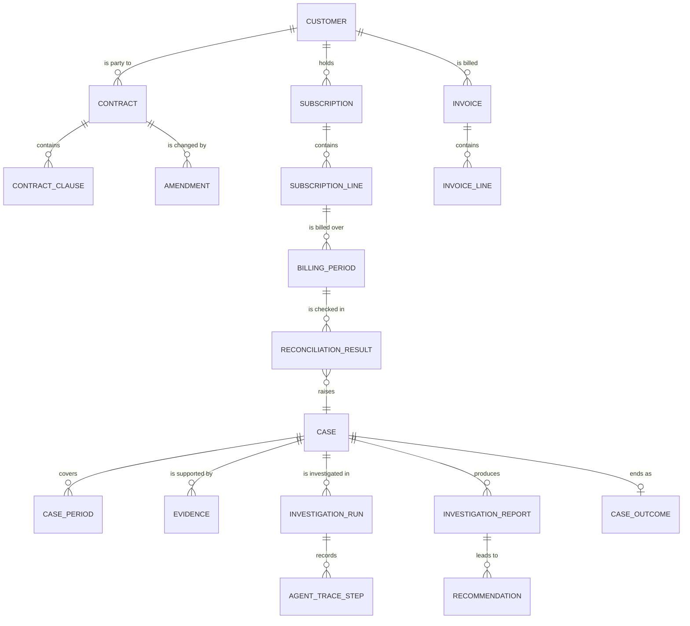

# Data model

## What this means

A data model is the list of things the system remembers, and the shape it
remembers them in: which facts are stored, what each is called, how records point
at each other, and which facts are never allowed to change.

It matters here because this product's output is an accusation about money. When
the system says "you were under-billed by $3,600 in April", a reviewer must be
able to walk from that number back to the exact invoice line and contract clause
it came from. That requires keeping three things strictly apart: what an external
system reported, what our code computed, and what the AI or a human decided.
Every table therefore carries a **class**, which decides who may write it,
whether a value counts as a fact or a claim, and how long it lives.

## Classification codes

| Code | Class | Meaning |
|---|---|---|
| SRC | Source as reported | A mirror of an external system. Never corrected, never rewritten. |
| NORM | Normalized | The resolved, canonical view shared by every consumer. |
| DERIV | Computed | Produced by deterministic code from other tables. Reproducible. |
| CASE | Investigation state | The lifecycle of a suspected discrepancy, from detection to decision. |
| AI | Model output | Prose and structured claims produced by the language model. |
| HUM | Human decision | An approval, rejection or recorded exception, with a named actor. |
| OPS | Infrastructure | Runs, queues, audit trail, evaluation and cost bookkeeping. |

## Source-derived (SRC)

These mirror the five systems: insert and append only, never update or delete.

| Table | Purpose |
|---|---|
| `contract` | The agreement's commercial header — dates, term, renewal, currency, status — plus the raw payload. |
| `contract_clause` | Contract text split into clause-level chunks, each with its clause type, character span, embedding and search vector. |
| `amendment` | A change order against a contract, with its effective and signed dates. |
| `amendment_term` | The individual before/after values an amendment changes — the main driver of "amendment not propagated" leakage. |
| `subscription` | What the CRM says the customer is subscribed to, including billing frequency and billing anchor. |
| `subscription_line` | One product/quantity/price row inside a subscription. SCD-2, so a change closes the old row and opens a new one. |
| `implementation` | Go-live and actual activation dates, onboarding fee, and what services were delivered. |
| `usage_snapshot` | What the product actually recorded for a customer, product and metric over a period. |
| `invoice` | The billing system's invoice header. |
| `invoice_line` | The billing system's invoice lines, each carrying the service period that proration math compares against. Read-only forever. |
| `credit_memo` | Money credited back to a customer. Nets off actual billed, and evidences recovered revenue. |
| `crm_opportunity` | What sales recorded about the deal — stage, amount, discount, close date, owner. |
| `fx_rate` | Exchange rates by currency pair and as-of date. The only permitted source of a conversion factor. |

## Normalized (NORM)

| Table | Purpose |
|---|---|
| `customer` | The one resolved customer entity. Source identifiers are links on this row, not identity. |
| `customer_alias` | Every other name the customer appears under, per system, with a match confidence. |
| `product` | The canonical product: SKU, unit of measure, list price and currency. |
| `product_alias` | Historical or per-system SKUs that map onto a canonical product, with validity dates. |
| `pricing_rule` | The prices that may apply — list, tiered, volume, contract override, promo — resolved deterministically by priority then specificity. |
| `entity_resolution_match` | A record of every matching decision between two references, and whether a human confirmed or rejected it. |

## Computed (DERIV)

| Table | Purpose |
|---|---|
| `contract_term` | One extracted term — base price, notice period, uplift cap, minimum commitment — with its extraction method, confidence and source clause. |
| `billing_period` | The materialised half-open date interval a subscription is billed over, with proration metadata. |
| `reconciliation_result` | The raw output of one check for one customer, line and period: expected, actual and the delta between them. |
| `change_event` | A field-level before/after diff, used to answer "what changed?" for a case. |

`contract_term` sits on a boundary: the design marks it `SRC/DERIV`, because its
value is extracted from source prose rather than reported by a system. Its
`extraction_method` column records whether a rule, the model or a human made it.

## Investigation state (CASE)

| Table | Purpose |
|---|---|
| `case` | One persistent mismatch, deduplicated across periods. Holds the leak type, amounts, status, severity and confidence. |
| `case_period` | The link between a case and each billing period it covers, which is what makes "five months = one case" concrete. |
| `evidence` | A citable fact tied to a real source row, with the excerpt and label shown in the interface. |
| `recommendation` | The proposed correction, its target system and record, and its approval state. A proposal only — never executed. |
| `investigation_run` | One execution of the agent for a case, with its tool-call and token budgets, usage, and terminal reason. |

The design labels most of these `DERIV` and `investigation_run` as `OPS`; they are
grouped as CASE here because the pipeline is their only writer and all are keyed by `case_id`.

## AI-generated (AI)

| Table | Purpose |
|---|---|
| `investigation_report` | The versioned report: hypothesis, narrative, root-cause category, proposed correction, and the single permitted qualitative factor. Never overwritten. |
| `agent_trace_step` | One step of the agent loop: phase, tool called, arguments, result summary, tokens and latency. Append-only. |
| `qa_message` | A question or answer in the case-scoped "ask the investigator" chat, with citations and a refusal flag. |

## Human decision (HUM)

| Table | Purpose |
|---|---|
| `case_outcome` | What actually happened to the money: recovered, partially recovered, written off, false positive, accepted exception. |
| `approved_exception` | The registry of legitimate reasons a gap exists — free pilot, approved discount, grace period, grandfathered rate. The answer to "is this legitimate?" is a lookup here. |

## Infrastructure (OPS)

| Table | Purpose |
|---|---|
| `reconciliation_run` | One detection run: as-of date, scope, counters, engine version and a config hash that makes it reproducible. |
| `audit_event` | Append-only record of every state change, with actor, before and after values. Immutable by database trigger. |
| `golden_label` | The ground-truth answer for a generated scenario. Known by construction, because the generator injected it. |
| `job` | The Postgres-backed work queue row: type, status, payload, attempts, retry time and lock owner. |
| `llm_call` | One model call: purpose, model, prompt hash, tokens, latency, cost and status. |
| `eval_run` | One execution of an evaluation suite, stamped with the git SHA and dataset version. |
| `eval_result` | One scored item inside an eval run: expected, actual, pass flag and score. |

## Key relationships

The diagram keeps to the spine of the model, following a dollar figure to its source.

The path from a number to its proof: `invoice_line` says what was billed,
`billing_period` and `contract_term` say what was owed, `reconciliation_result`
records the gap, `case` aggregates it across periods, `evidence` cites the exact
rows, and `case_outcome` records the human decision. Every step is separately
queryable, so the audit trail is reconstructable rather than asserted.

## Immutability and write rules

| Behaviour | Tables |
|---|---|
| Append-only, update and delete blocked by trigger | `audit_event`, `agent_trace_step` |
| Insert only — no update or delete by any application role | `invoice`, `invoice_line`, `contract`, `subscription_line` |
| Versioned, never overwritten | `investigation_report` |
| Upserted on a natural key, so re-runs are idempotent | `billing_period`, `reconciliation_result`, `case`, `change_event`, `entity_resolution_match`, `golden_label`, `job` |
| Written once, then referenced by other tables | `evidence`, `recommendation`, `case_period`, `case_outcome` |

**No code path writes to a source table after ingestion.** The agent connects as
a Postgres role holding `SELECT` only on source tables, so this is a permission
the database enforces, not a convention the code follows. The ingestion role may
insert source rows but cannot update or delete the four financial tables above. A
way around this would be a bug to report, not a tool to use.

**A single writer owns the confidence score.** `case.confidence_score` is written
only by the confidence module, and a test asserts no other module writes that
column. Otherwise two code paths could disagree about how confident the system
is, and neither would be authoritative.

## Keys and idempotency

Every table carries a UUID primary key plus `created_at` and `updated_at`, and a
**natural key**: the business fact that makes two rows the same row. Writers upsert on it.

| Table | Natural key |
|---|---|
| Source tables | `(source_system, source_id)` |
| `fx_rate` | `(base_currency, quote_currency, as_of_date)` |
| `usage_snapshot` | `(customer, product, metric, period_start)` |
| `billing_period` | `(subscription_id, period_index)` |
| `reconciliation_result` | `(run_id, customer, line, period, check_code)` |
| `case` | `case_key` |

`case_key` is a fingerprint hashed from `(customer, subscription_line, leak_type,
product)` and deliberately **excludes the billing period**. That omission turns a
five-month mismatch into one case rather than five, enforcing the rule
structurally rather than relying on a developer to remember it. A new mismatching
period extends the case's range and adds a `case_period` row; never a duplicate.

The uniqueness constraint on `reconciliation_result` makes detection idempotent:
re-running over unchanged data writes zero new rows, because every check recomputes
the same key. It is also why raw detector output has its own table rather than
being folded into `case` — detection stays reproducible however cases are clustered.

## Indexes worth knowing about

- `contract_clause.embedding` carries a pgvector index, turning "find the clause
  about price uplift" into a nearest-neighbour search over vectors, not a text
  match.
- `contract_clause.tsv` carries a GIN index for fast full-text search over the
  same clause text.
- The two are used together: retrieval runs a semantic and a lexical search, then
  fuses the rankings. Each hit keeps its `source_clause_id`, letting the Verifier
  re-fetch the exact text a report cited rather than trust the model's summary.
